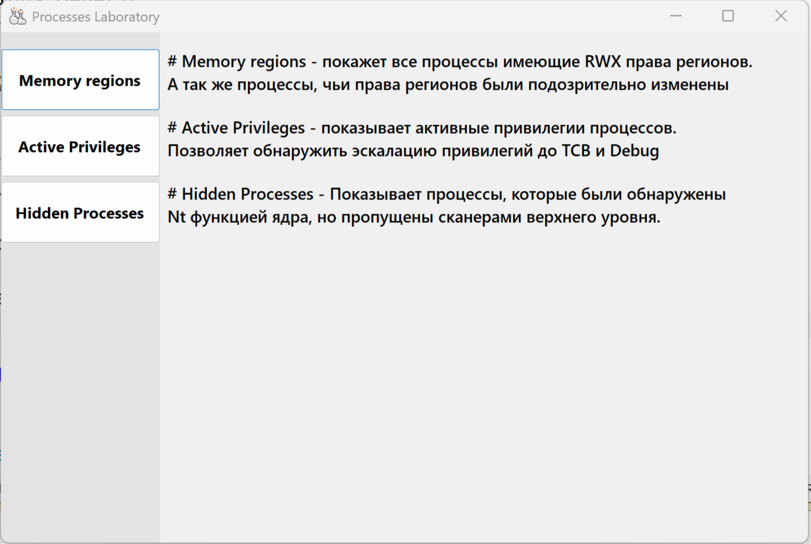
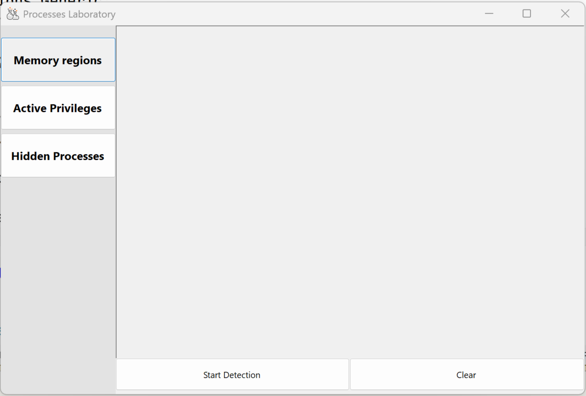
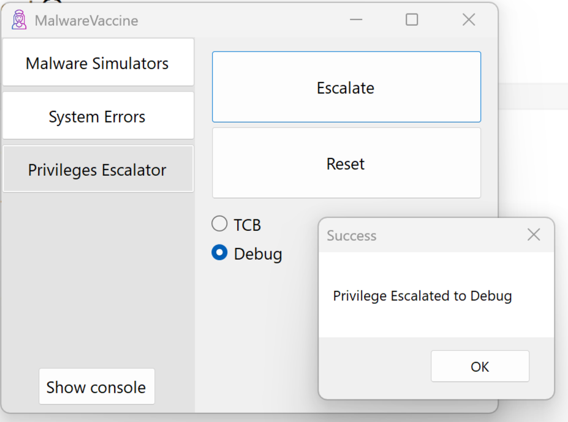
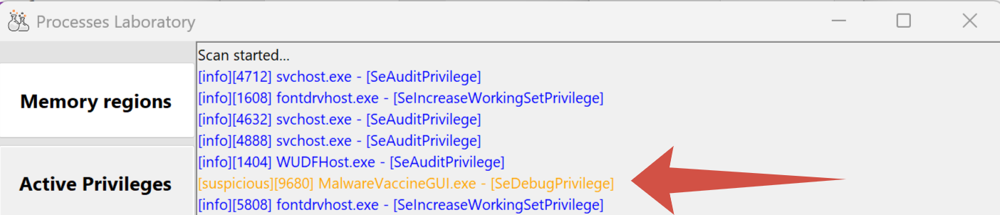

# Утилита для анализа процессов OS Windows.

## Реализованный функционал:
- Сбор информации о процессах двумя способами - ToolHelp и Nt
- Поиск скрытых процессов (Базовый)
- RWX сканнер - поиск RWX регионов памяти процессов, а так же регионов, чьи права были изменены с RX на RW и RW На RX (RX->RW->RX последовательность для инжекта произвольного кода)
- Сканнер всех включенных привилегий - индекс PID, имя процесса - все включенные привелегии. 

Для сборки потребуются:
- cmake
- conan2
- Windows PowerShell
``` bash
git clone https://github.com/MyAngelWhiteCat/ProcessesLaboratory.git
cd ProcessesLaboratory
mkdir build && cd build
conan install .. --build=missing -s compiler.runtime=static -s build_type=Release --output-folder=.
cmake .. --preset conan-default
cmake --build .
```

## Usage Case:
При открытии утилиты вас встретит главное меню с кратким описанием функций
и номером текущей версии





Для работы нужно выбрать соответствующий сканер, после чего откроется
новое меню, готовое к выводу информации. В его нижней части
находятся 2 кнопки - scan и clear. Их смысл соответствует названиям.





Протестируем сканирование активных привилегий. Для теста будем использовать 
безопасный инструмент [MalwareVaccine](https://github.com/MyAngelWhiteCat/MalwareVaccine).
Повысим привилегии процесса по Debug. Об успехе операции нам сообщает соответсвующий MessageBox.





Теперь запустим сканирование, выбрав сканер Active Privileges и нажав кнопку Scan.
В выводе наблюдаем наш тестовый процесс MalwareVaccine, так же видим его PID, активную привилегию


и отметку - подозрительный процесс (suspicious).


Таким образом можно ознакомиться с интерфейсом утилиты.

## Current task:
- 

### UI
- Реализован UI на чистом WinApi в файлах gui.h gui.cpp
- Реализован С# .Net GUI для современного интерфейса
  
### Бэклог
- domain::SuspiciousProcess - явный антипаттерн, нужно заняться.
- domain превратился в подборку "Топ полезных функций, структур и классов для программирования на С++ с использованием WinAPi смотреть онлайн бесплатно". Нужно структурииировать и разбить на отдельные модули.
- Разработать формат возврата данных о включенных привилегиях.
- Разработка эвристик помечания привилегий процесса "Escalated" и оценки серьезности.

## TODO:


### Анализаторы
- Скачки потребления ресурсов
- Подозрительные интернет соединения
- Скрытые процессы
- Подозрительные пути исполняемых файлов
- Инжектированный код в памяти
- Процессы с изменяющимися именами
- Необычные DLL модули
- Повышенные привилегии
- Аномальное время работы
- Процессы без цифровой подписи
- ...

